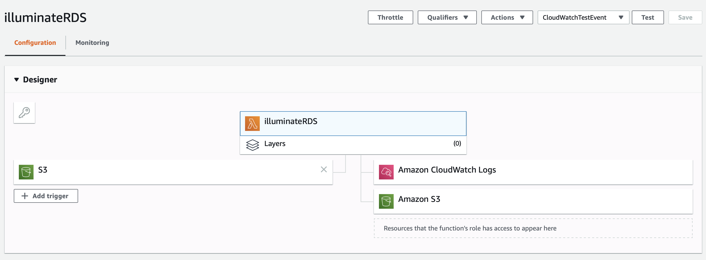

INSTALL file for Illumio RDS visibility function

1. Illumio
   1. We would need API credentials from Illumio ASP for the Lambda function to make the REST API call. 
   1. You could get this information from the PCE UI. Follow the below steps to generate the credentials for the Lambda function. 
   1. We will need this credential later when we create the AWS lambda function
      1. Login to PCE web UI.
      1. From top right, click your login name.
      1. Click My API Keys.
      1. Click Add from the top.
      1. Fill in the form and click save to generate the credentials.
      1. Download the credentials as this is the only time you will be able to download the credentials.
   1. We will create an Illumio Unmanaged workload for every RDS instance we would like to visualize the flow for.
   1. We will also create a Virtual service with the RDS endpoint, protocol and port
   1. You could look for the steps to create unmanaged workload and virtual service from Illumio ASP “PCE Web Console Users Guide Link to documentation page here https://support.illumio.com/public/documentation/index.html

1. AWS Cloud
   1. Amazon S3 console
      1. Create a S3 bucket and copy the ARN. Keep all the settings default

   1. Lambda console
      1. Create a Lambda function from the AWS Lambda console and Add trigger by configuring a S3 bucket created in 1.a above. For the Event type, select 'All object create events'.
      1. For the Lambda role, add AWSLambdaExecute policy to the Lambda IAM role so that it can access S3 objects.
      1. An example configuration is shown in 3 below.
      
         
      
      1. Copy the function code from the GitHub src directory of this repository.
      1. Create the environment variables as mentioned below with the credentials we created in section A.1 under Illumio at the beginning.
          1. ILLUMIO_SERVER - Value should be the Illumio PCE URL without any https
          1. ILO_API_KEY_ID - The API key id for the Lambda function to use
          1. ILO_API_KEY_SECRET - The API key secret for the Lambda function to use
          1. ILO_API_VERSION - Version of Illumio API
          1. ILO_ORG_ID - Illumio PCE Org ID to be utilized for this deployment
          1. ILO_PORT - Illumio PCE port for the Lambda to communicate for the API calls
      1. Scroll to the end of the Lambda function page to the Concurrency setting, Set Reserve Concurrency to 1 and then hit Save button at the top Right corner to Save the Lambda function
      1. This completes the configuration and creation of the Lambda function on the AWS portal
   
   1. EC2 console 
      1. Create a flow log subscription for the RDSNetworkInterface from the EC2 Network Interfaces portal for the RDS instance that you desire to visualize.
      1. Please, select the destination as "Send to an S3 bucket" and enter the S3 bucket ARN created in 1.a above and for the log format select custom format and add the following attributes: srcaddr dstaddr dstport protocol tcp-flags pkt-srcaddr pkt-dstaddr srcport action type.
      1. Please ensure the attributes are in the order mentioned above.

   1. You can now monitor the CloudWatch Log stream to see the logs generate at the time of Lambda function execution
