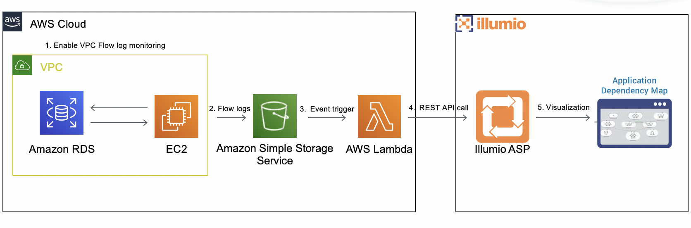

# **Unraveling Amazon RDS security by visualizing traffic flows and segmentation policy using Illumio**

**Project Description**

This repo contains the code for lambda function that allows users to visualize the flows for an Amazon RDS instance using VPC flow logs and Illumio ASP

**Project Technology stack** 

The lambda function is written in python3.6 and can be directly pasted in the AWS lambda python runtime

**Project workflow** 

## Installation

Detailed instructions on how to install, configure, and get the project running are mentioned 
in [INSTALL](INSTALL.md) document.

## Help or Docs 

If you have questions, please use slack for asking them.
If you have issues, bug reports, etc, please file an issue in this repository's Issue Tracker.

## Contributing

Instructions on how to contribute:  [CONTRIBUTING](CONTRIBUTING.md).

